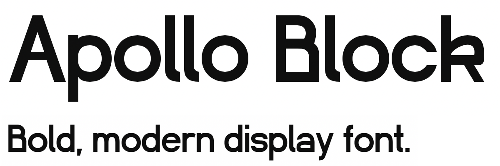

Apollo is a family of sans-serif fonts under the CC BY-SA license. Currently, Apollo has the following members (1):

Apollo Block is currently WIP. It looks too display-font-y for me; I want to slowly iterate on it to be a text font that is inoffensive, compact, and easy to read.

I also want to add [text figures](https://en.wikipedia.org/wiki/Text_figures) (lowercase numbers) to Apollo Block.
